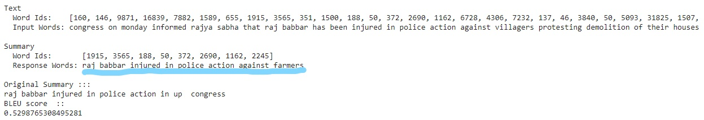
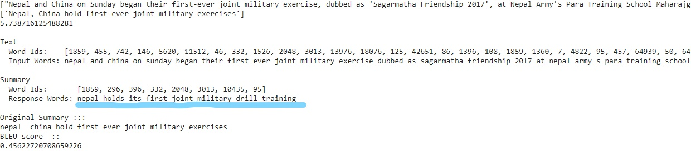

# Abstract-Text-Summarization
This is a project where we can provide lagre news articles or text as input to it and get a short, condensed, fluent and concise synopsis of it like headlines or summary which is near to human generated summary with new words and phrases related and describing the article.
 

 

 
**Output of the news articles with predicted headline marked with blue colur and original headline**
